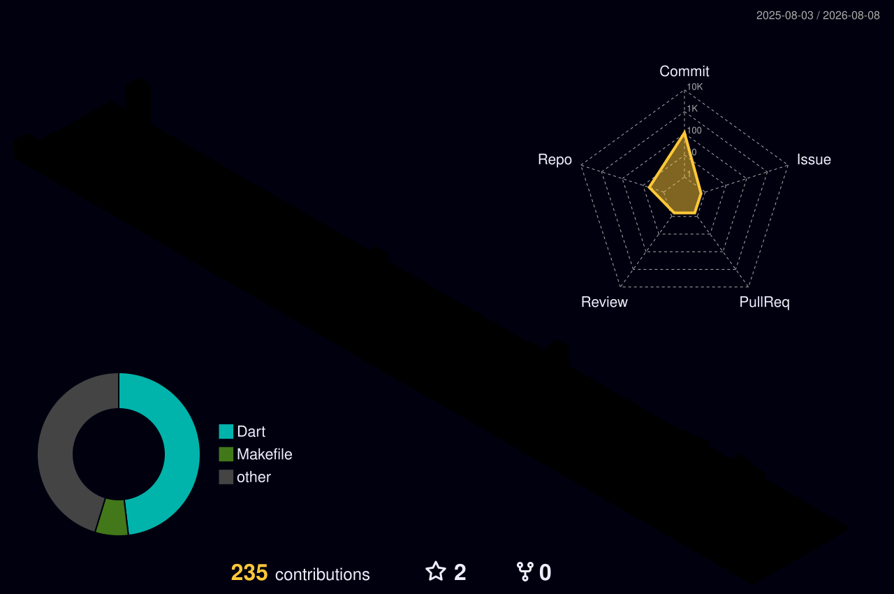

<div align="center">

# Hi 👋, I'm Dethanev

**Computer Science Student ｜ Software Developer ｜ Server Administrator**

<br>


</div>

<br>

## 💻 Tech Stack

### 💻 Languages
     

### 🌐 Frontend Development
    

### ⚙️ Backend & Server


### 📱 Mobile & AR
 

### 🗄️ Databases
  

### 🧠 Machine Learning


### 📝 IDEs & Editors
   

### 🤖 AI & Design


### 🛠️ Tools & DevOps
    
<br>

## 📈 Development Activity & Stats

### ⏱️ Coding Time
<!--START_SECTION:waka-->

```txt
From: 16 August 2025 - To: 19 May 2026

Total Time: 142 hrs

Java                40 hrs 33 mins        ███████░░░░░░░░░░░░░░░░░░   27.40 %
Dart                31 hrs 16 mins        █████▒░░░░░░░░░░░░░░░░░░░   21.12 %
Markdown            23 hrs 40 mins        ████░░░░░░░░░░░░░░░░░░░░░   16.00 %
Python              13 hrs 33 mins        ██▒░░░░░░░░░░░░░░░░░░░░░░   09.16 %
Swift               9 hrs 55 mins         █▓░░░░░░░░░░░░░░░░░░░░░░░   06.71 %
Other               6 hrs                 █░░░░░░░░░░░░░░░░░░░░░░░░   04.06 %
```

<!--END_SECTION:waka-->
<br>

<div align="center">

[](https://git.io/streak-stats)



</div>

<!-- Proudly created with GPRM ( https://gprm.itsvg.in ) -->

